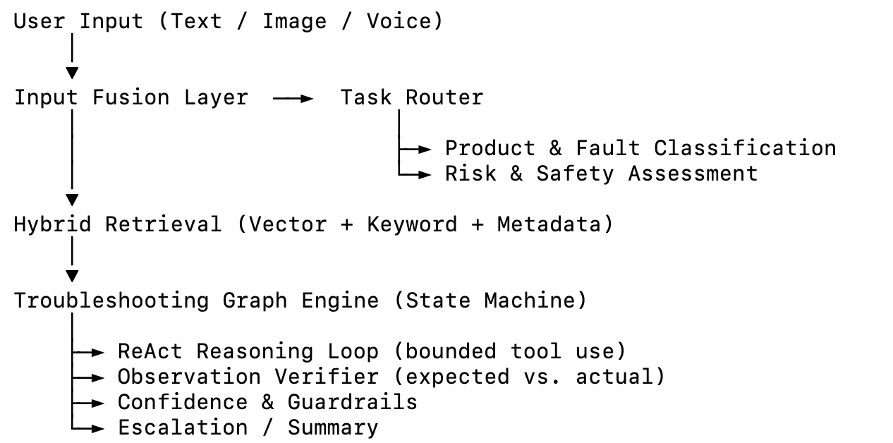

🧠 SmartCare-Agent

Multimodal AI Support & Training Agent for Medical Equipment

Converts manuals, SOPs, and troubleshooting guides into an interactive AI agent that understands text, images, and voice.
Built for healthcare equipment like CT, MR, and ultrasound systems — combining RAG, ReAct reasoning, and Troubleshooting Graphs to deliver safe, explainable, step-by-step assistance.

⸻

🚀 Overview

SmartCare-Agent is an AI-driven support and training system designed for medical device operation, maintenance, and troubleshooting.
It automatically interprets user issues (text, image, or audio), retrieves structured repair procedures from manuals, and walks engineers through each verified step — reducing service load and ensuring safety compliance.

Core goals:
	•	✅ Understand multimodal user queries (text, image, audio)
	•	🔍 Retrieve verified troubleshooting steps using RAG
	•	🧠 Reason through steps using ReAct (Reason → Act → Reflect)
	•	⚙️ Enforce deterministic workflows via Troubleshooting Graphs
	•	🛡️ Provide confidence-based fallback & escalation
	•	📊 Continuously learn from logs and resolved sessions

⸻

🧩 System Architecture

  

### 🔗 Component ↔ Code Mapping

| System Layer | Module(s) | Description |
|---------------|------------|--------------|
| **Input Fusion Layer** | `multimodal_parser.py` | Handles text, OCR, and ASR input. |
| **Task Router** | `router.py` | Classifies product, fault, and risk. |
| **Hybrid Retrieval** | `retriever.py` | Combines FAISS, BM25, and metadata filters. |
| **Troubleshooting Graph** | `graph_engine.py` | YAML-driven state machine for procedural flows. |
| **ReAct Loop** | `react_tools.py`, `agent_controller.py` | Structured reasoning via tool calls. |
| **Observation Verifier** | `graph_engine.py` | Checks actual vs. expected values. |
| **Confidence & Guardrails** | `guardrails.py` | Enforces safety thresholds and escalation. |
| **Escalation / Summary** | `agent_controller.py` | Final response, summary, or human handoff. |
